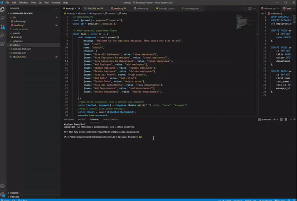

# 12 SQL: Employee Tracker

[](https://opensource.org/licenses/MIT)

  ## Description:
  This is a simple terminal based application that allows users to add, view, delete and update an employee database. This application uses an inquirer, mysql2, and console.table npm packages. The database is manipulated using MySQL.

  

  ## Table of Contents 
  - [Description](#description)
  - [License](#license)
  - [Usage](#usage)
  - [Features](#features)
  - [Contribution](#contribution)
  - [Questions](#questions)

  ## License:
  [](https://opensource.org/licenses/MIT)

  ## Usage:
  - Clone this repository on your local machine.
  - Open your terminal
  - To install necessary dependencies, type:
  ```
  npm install
  ```
  - The start the application, run:
  ```
  node server.js
  ```
  - Follow the Terminal Commands to use the application

  ## Features

  The Application allows the User to:
  - View Employees
  - View Employees by Manager
  - View Employees by Department
  - View Departments
  - View Roles
  - Add Employees
  - Add Departments
  - Add Roles
  - Update Employees
  - Remove Employees
  - Remove Departments
  - Remove Roles

  ## Questions:
  Have any questions?\
  Feel free to contact me at:
  - Github: [OmarAce](https://github.com/OmarAce)
  - Email: omarace95@gmail.com